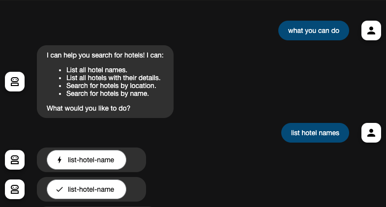
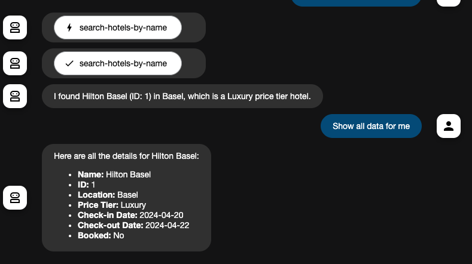

# MCP Server for Big Query

## 目標

- Big Queryを操作するためのMCP Serverを構築する

## 目的

1. 技術観点: MCP Server for BQのための知見を蓄積する
2. チーム観点: テーブル調査業務を簡単にする

## Vertex AIの有効化

### 1. Vertex AIのAPIを有効化

### 2. Application Default Credentialを取得

```sh
$ gcloud auth application-default login
```

## MCP Toolbox for Database

このToolboxはAI Agentがデータベースにアクセスするためのtoolを提供する
toolとは、AI Agentが使用する外部リソースへのアクセス手段のことである。
以下に示すようにAgentが自律的にデータベースにアクセスすることをサポートする。



### Install Toolbox for Mac

- Version: [0.7.0](https://github.com/googleapis/genai-toolbox/releases/tag/v0.7.0)

```sh
$ wget https://storage.googleapis.com/genai-toolbox/v0.7.0/darwin/arm64/toolbox
$ chmod +x toolbox
```

### Configure Toolbox

- データソースを指定

```yaml
  my-bigquery-source:
    kind: bigquery
    project: mcp-server-for-big-query
    location: US
```

- Agentに利用可能なtoolを提供

```yaml
toolsets:
  my-toolset: # Toolset name
  - search-hotels-by-name
  - search-hotels-by-location
```

- 具体的なtoolの定義

```yaml
  search-hotels-by-name:
    kind: bigquery-sql
    source: my-bigquery-source # Source name
    description: Search for hotels based on name. # Description
    parameters: # Parameters for the SQL query
    - name: name
      type: string
      description: The name of the hotel.
    # 与えられたホテル名を用いた曖昧検索を行うSQL文
    statement: SELECT * FROM `sample.hotels` WHERE LOWER(name) LIKE LOWER(CONCAT('%', @name, '%'));
```

### Running Toolbox Server

```sh
$ ./toolbox --tools-file tools.yml
2025-06-27T16:55:21.625816+09:00 INFO "Server ready to serve!" 
# localhost:5000 でToolbox Serverが起動します
```

- 動作確認

```sh
$ curl http://127.0.0.1:5000
🧰 Hello, World! 🧰%     
```

## MCP Server

以上で設定したToolboxとAI Agentを接続し、MCP Serverを構築する。

```py
toolbox = ToolboxSyncClient("http://127.0.0.1:5000")
```

Agentにtoolsを引数として渡すことでToolboxを利用できるようになる。

```py
tools = toolbox.load_toolset("my-toolset")

root_agent = Agent(
    ...,
    tools=tools,
)
```

### .env　for ADK

```sh
GOOGLE_GENAI_USE_VERTEXAI=TRUE # Vertex AIを使用する場合はTRUE
GOOGLE_CLOUD_PROJECT=GCP_PROJECT # Google CloudプロジェクトID
GOOGLE_CLOUD_LOCATION=global # Vertex AIのロケーション
```

### Running MCP Server

```sh
$ cd hotel_agent
$ adk web
INFO:     Uvicorn running on http://127.0.0.1:8000 (Press CTRL+C to quit)
```

- 動作確認

ブラウザで、`localhost:8000`にアクセスし、チャットに`hello`と入力
何らかのレスポンスが返って来ればOK

## MCP Server for Big Query全体の動作確認

ブラウザで、`localhost:8000`にアクセスし、以下を入力

```
search for Comfort Inn Bern
```

下記画像のようなレスポンスが返って来ればOK



## MCP ToolboxとIDEを連携する

### Windsurf

- Cascade Assistant > MCP > Configure MCP > View Raw Config

```json
{
  "mcpServers": {
    "bigquery": {
      "command": "./PATH/TO/toolbox",
      "args": ["--prebuilt","bigquery","--stdio"],
      "env": {
        "BIGQUERY_PROJECT": "PROJECT_ID"
      }
    }
  }
}
```

### Cursor

`.cursor/mcp.json`

```json
{
  "mcpServers": {
    "bigquery": {
      "command": "toolbox",
      "args": ["--prebuilt","bigquery","--stdio"],
      "env": {
        "BIGQUERY_PROJECT": "PROJECT_ID"
      }
    }
  }
}
```
### VSCode

`.vscode/mcp.json`

```json
{
  "servers": {
    "bigquery": {
      "command": "toolbox",
      "args": [
        "--prebuilt",
        "bigquery",
        "--stdio"
      ],
      "env": {
        "BIGQUERY_PROJECT": "mcp-server-for-big-query"
      }
    }
  }
}
```

## 参考

- [ADK と MCP Toolbox for Databases を使った BigQuery エージェントの開発 - Zenn](https://zenn.dev/hiracky16/articles/90162823db6a4b44a839)
- [google-toolbox - GitHub](https://github.com/googleapis/genai-toolbox) 
- [Connect your IDE to BigQuery using MCP Toolbox - Google Cloud](https://cloud.google.com/bigquery/docs/pre-built-tools-with-mcp-toolbox)
